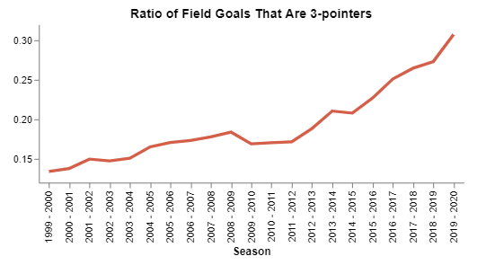
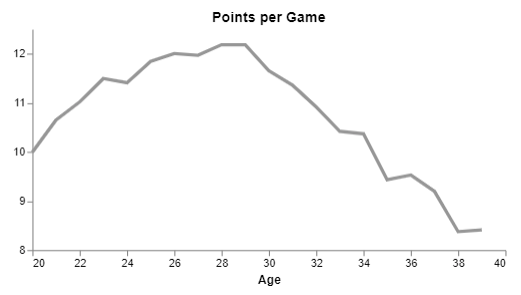
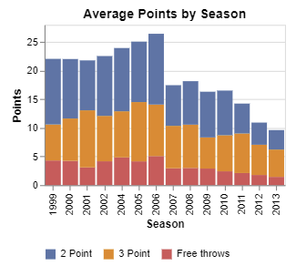
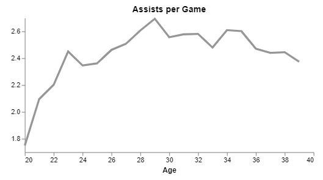
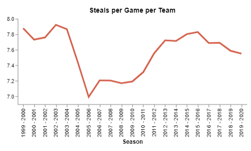
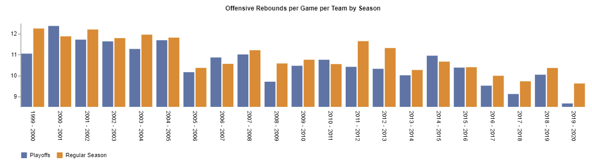
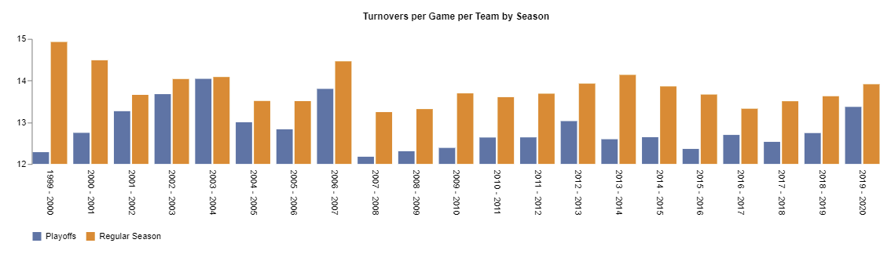

# NBA Data Analysis Dashboard Report

#### Connor Fairbanks

#### March 26, 2021

## Executive Summary

How can a data dashboard help a general manager to create a winning basketball team? By collecting, analyzing, and displaying player statistical data in charts that are easy to interpret, a data dashboard makes all kinds of valuable information accessible to team staff. Patterns such as the increasing trend in the volume of 3-point shooting, the effect that rule changes have on games, and the differences between regular season and playoff games are all clearly visible when using our dashboard. This information will not only help the team to win more games, it will allow them to do so by uncovering competitive advantages which will cost the team less money than traditional strategies. The earlier a team can notice changing trends in the style of play in the NBA, the sooner they can embrace those changes and put themselves ahead of other teams. This report will also demonstrate how winning more games and championships not only fosters fan enjoyment and loyalty, but also results in a substantial financial return for the team.

## Introduction

Why is winning a championship in the NBA valuable? When we look back at the last twenty NBA championships, fifteen of them have been won by four teams1. That means that 13.3% of teams have won 75% of the NBA championships over the last twenty years. When we look at monetary value of those four teams, we notice that all of them rank in the top half of the league, and two of them (the Los Angeles Lakers and the Golden State Warriors) rank in the top three2. If we dive deeper into the finances of the Golden State Warriors, we will see that they were last sold in the year 2010 for about $450 million3. Between 2010 and 2021, the team won 3 NBA championships, and are now valued at $4.7 billion2.

When a team wins championships, they earn more fans, who buy more tickets and merchandise. This trend can be seen in the Philadelphia 76ers organization. In the 2013-2016 seasons, the 76ers did not win more than 19 out of 80 games in each of the three seasons4. During this time of poor play, the average attendance at games was never above 15,000 fans5. By utilizing high draft picks, the 76ers have improved in recent years. During the 2017-2019 seasons, Philadelphia won over 58% of their games4. The team was playing in the same arena with the same number of seats, but spectator attendance rose to over 20,000 fans per game during both of those seasons5. Success on the court led to success at the ticket booth. The popularity of winning teams also allows them to earn more money from advertising partnerships, as well as television and radio deals. It is clear that winning games contributes substantially to the financial state of an NBA team.

Teams can increase their profits by earning more money, or alternatively, they can cut their costs. An NBA team's largest expense by far is player salaries. Players make up 52% - 58% of NBA teams business expenses (the next closest expense is business operating expenses at 18%)6. By analyzing data, a general manager may be able to find players that exhibit certain statistical attributes that contribute to winning. If other teams do not have access to this type of analysis, that particular player may be undervalued in the player market. By signing undervalued players, a general manager is simultaneously increasing their team's chances of winning, and reducing their business expenses. These types of player signings are the actions that allow a general manager to please the team ownership and keep their job long term. Only eight out of the thirty actively employed general managers in the NBA have been at their current position for over five years (and only three have been there for over ten years)7. Longevity is obviously an illusive goal in the general manager's position. By utilizing a data dashboard, a general manager will be able to help their team win more games, earn more money, and decrease their own chances of being fired for poor team performance.  

The remainder of this report will demonstrate the value of a statistical data dashboard, and will answer the question, "How can a data dashboard help us win more games?". The dashboard will be used to show the changes in how points are being scored in today's NBA. The influence that rule changes can have on the game will also be explored. The differences between playoff and regular seasons games will be analyzed and discussed. As coaches and team staff use this information, they will be able to find success in the competitive landscape that is the NBA. 

## How Points Are Scored

It has become clear that over the last few years, the 3-pointer is becoming more important in the NBA. By using our data dashboard, we are able to see when this trend started/accelerated: 

  

  
The average ratio of shots that are 3-pointers in the NBA by season. A plateau is evident from 2008-2012, then an accelerated increase after 2012. 

As teams have begun to embrace the value of the 3-point shot, we have seen an increase in the proportion of shots that are 3-pointers. We can look at the Houston Rockets as an example. Their former general manager (Daryl Morey) is known for his use of analytics based basketball management. The Rockets missed the playoffs three seasons in a row (starting in 2009-2010). During this time, the Rockets never ranked higher than fifth in the league in 3-pointers per game. In the 2012-2013 season, they seemed to fully buy in to the 3-point strategy and have always been ranked first or second in league in 3-pointers per game since that time8. The Rockets have always made the playoffs since the 2012-2013 season. We also see this trend with another team. When the Golden State Warriors had the winningest season in NBA history (2015-2016 season), they led the league with 13.1 3-pointers per game. The team with the second most 3-pointers per game that year scored 10.7. The Rockets displayed a similar pattern when in the 2017-2018 season, they had more wins than any other team and scored a league leading 15.3 3-pointers per game (when the next closest team scored 12.7 3-pointers per game)8. 

The point of sharing these examples is to illustrate the benefits that can be realized when teams capitalize on recognizing these trends. If a general manager had access to a chart like this in 2014, they may have realized that the trend of 3-point shots per game was increasing. By comparing successful teams to these trends, one may be able to get ahead of the majority of the league when making game plan decisions or player acquisition choices. The dashboard allows managers to analyze trends of dozens of statistics by simply selecting them from a dropdown menu. Access to these trends may allow our team to become the next Golden State Warriors, or Houston Rockets that lead the league by finding an advantage through statistical analysis. 

## How Do Players Age?

One challenge that general managers face is the decision of when to sign players to contracts, and for how long the terms of those contracts should last. Depending on the strategy your team is pursuing, you may be looking for players that score the most points, or get the most rebounds, or block the most shots. We can see what a player has done in the past by looking at old statistics, but how can we get an idea of how they will perform during the next few years of their contract? The data dashboard allows managers to see, on average, what happens to a players statistics as they age. For instance, if we look at points per game we see the following graph:

  

  
The average points per game scored by players as they age. We see an incline during the younger years with a peak at ages 28-29, and a decline from age 30 onwards. 

When trying to maximize points per game, the best value would be found by signing a player to a long term contract in their early to mid-twenties. A player like that would likely be less costly to sign because their current points per game are still relatively low, but they have potential to improve. Signing an all-star scorer at the age of thirty is a risky decision. Although a thirty-year-old has proven their scoring ability in the past, we can see from this chart that their scoring production is likely to decline quickly as the years progress. We can use the dashboard to evaluate one individual player to see if they have reached their scoring peak. Let us look at Ray Allen as an example: 

  

  
Ray Allen's average points by season. 

We can see that Ray Allen's point scoring volume began to decline during the 2006-2007 season. Allen was 31 years old during that season. This reinforces a managers decision to think twice about long term contracts for scorers after the age of thirty. 

A different story of aging is told when we look at the league averages for assists per game:

  

  
The average assists per game made by players as they age. Players tend to maintain their ability to pass the ball as they age. 

As players age, they tend to retain their ability to distribute the ball by making assists. A general manager may use this data to calm their reservations about signing a thirty-year-old point guard to a five-year contract. That is if they are primarily looking for someone to pass the ball to other younger players for scoring opportunities. 

## How Do Rule Changes Affect The Game?

The "hand checking" rule was implemented during the 2004-2005 season in the NBA9. This rule states that a defensive player will be called for a foul if they initiate contact with an offensive player with their hands. This rule was implemented to prevent defensive players from slowing down the game by using their hands to slow the offensive player's movement. We can see the dramatic effect this rule had on one statistic in particular: 

  

  
The average steals per game per team by season. We can see a sharp decline once the "hand checking" rule was implemented in the 2004-2005 season. 

Obviously "hand checking" was an effective technique that allowed defensive players to steal the ball more often. Once that technique was considered illegal, there were less steals. This graph shows that the decisions that the league makes to change rules can have a substantial effect on how the game is played. A manager could use this information to make the decision to sign faster players. If defensive players can no longer use their hands to slow players down, then faster offensive players may gain an advantage over players with average speed. As the league evolves, more rules will change in the future, and a dashboard like this will allow teams to understand the effects of those rule changes, and potentially benefit from that knowledge. 

## Playoffs Vs. Regular Season

What attributes do you want in a team that makes a deep run in the playoffs? Some teams do great in the regular season, but as soon as playoffs roll around, they seem to lose their edge and get eliminated in the first or second rounds. The data dashboard allows us to see how statistics change in the playoffs compared to the regular season. If we look at offensive rebounds, there appears to be a similar amount in each type of game (as seen by the similar height of the blue and orange bars):

  

  
The average offensive rebounds per game in regular season vs. playoff games in the NBA. Not much difference is seen between the two types of games. 

We can conclude from the information above that an offensive rebounder who performs well in the regular season should serve the team well in the playoffs.

When we then look at a statistic like turnovers per game, we see a different pattern:

  

  
The average turnovers per game in regular season vs. playoff games in the NBA. There seems to be less turnovers in the playoffs. 

The chart above leads us to believe that there are less turnovers in playoff basketball. A team which has players with a low turnover rate in the regular season may have an advantage when it comes to playoff basketball. A general manager may decide to trade for a guard who takes care of the ball (has a low turnover rate) before the playoffs begin. 

## Conclusion

We have only scratched the surface of the benefits available to a team that employs data based decision making in basketball strategy and team personnel decisions. By using the data dashboard that we have developed, a team can easily uncover the statistical trends of players, and the league as a whole, that will allow their team to find a competitive edge. This increased success on the court will also lead to financial success as a business in the sporting entertainment industry.

## References

1. NBA & ABA Champions. (n.d.). Basketball-Reference.Com. Retrieved March 25, 2021, from https://www.basketball-reference.com/playoffs/

2. Badenhausen, K. (2021, February 10). NBA Team Values 2021: Knicks Keep Top Spot At $5 Billion, While Warriors Seize No. 2 From Lakers. Forbes. https://www.forbes.com/sites/kurtbadenhausen/2021/02/10/nba-team-values-2021-knicks-keep-top-spot-at-5-billion-warriors-bump-lakers-for-second-place/?sh=371042f0645b

3. Blasi, W. (2020, May 26). How a millionaire outbid a billionaire to buy the Golden State Warriors in 2010. MarketWatch. https://www.marketwatch.com/story/how-a-millionaire-outbid-a-billionaire-to-buy-the-golden-state-warriors-in-2010-2020-05-26

4. NBA Teams: Philadelphia 76ers Records Year by Year. (n.d.). Land Of Basketball. Retrieved March 25, 2021, from https://www.landofbasketball.com/teams/records_philadelphia_76ers.htm

5. Statista. (2020, July 13). Regular season home attendance of the Philadelphia 76ers 2006–2020. https://www.statista.com/statistics/197977/nba-home-attendance-of-the-philadelphia-76ers-since-2006/

6. Wertheim, J. (2019, November 1). How Do NBA Franchises Spend Their Revenue? Team Executives Reveal Financial Info. Sports Illustrated. https://www.si.com/nba/2018/09/21/nba-teams-revenue-spending-breakdown-small-large-market

7. NBA Staff Members - RealGM. (n.d.). Real GM. Retrieved March 25, 2021, from https://basketball.realgm.com/nba/staff-members/16/General-Manager/Current

8. NBA & ABA League Index. (n.d.). Basketball-Reference.Com. Retrieved March 25, 2021, from https://www.basketball-reference.com/leagues/

9. Lantern, L. (2020, March 20). What is Hand Checking Rule in NBA. Dunk or Three. https://dunkorthree.com/hand-checking-rule-nba/#:%7E:text=When%20was%20Hand%20Checking%20Added,the%20defensive%20three%2Dsecond%20rule.